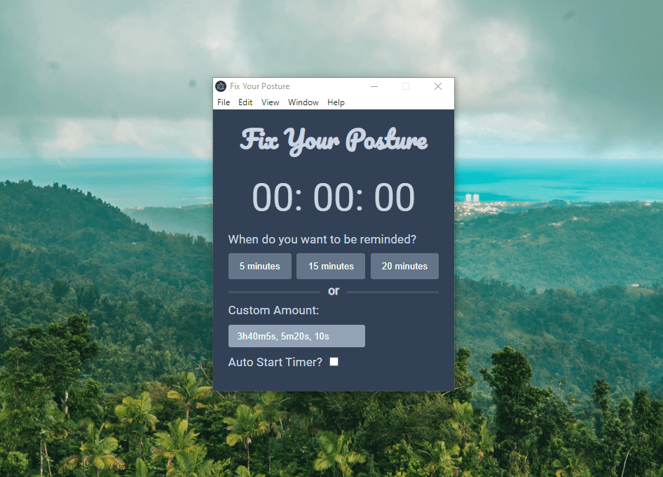

I am a Puerto Rico based fullstack software engineer that loves helping people using the latest and greatest web technologies.

For more information check out my [portfolio](https://ildervelez.netlify.app/).

## Contact Me

  
  

## Projects

<table style="border: none;">
  <tr>
    <td style="border: none; width: 50%;">
      <h2>Fix Your Posture</h2>
      
      
Fix Your Posture is a simple timer for desktops to remind you via notification to check your posture built using Electron and Vanilla Javascript and CSS

    </td>
    <td style="border: none; width: 50%">
      <h2>searching4u</h2>
      
      
searching4u is a web application that provides users a space to provide information on missing people, including their last known location with an interactive map.

      
<a href="https://github.com/ivel6482/Searching4U">Code</a> / <a href="https://searching-4u.herokuapp.com/">Live</a>

    </td>
  </tr>
</table>
