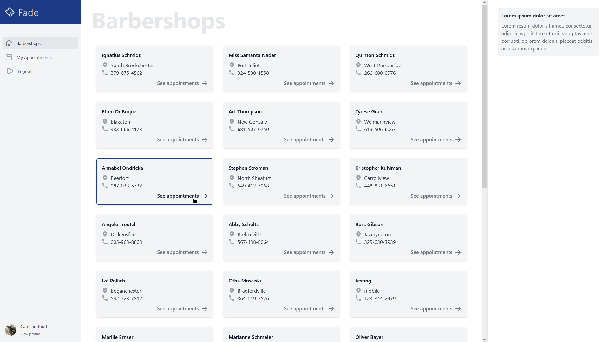

I am a Puerto Rico based fullstack software engineer that loves helping people using the latest and greatest web technologies.

For more information check out my [portfolio](https://ildervelez.netlify.app/).

## Contact Me

  
  

## Projects

<table style="border: none;">
  <tr>
    <td style="border: none; width: 50%;">
      <h2>Fade</h2>
      
      
Fade is a fullstack web application that barbers can use to post and manage their appointments and their customers can book them. Fade is a fullstack application built using Node.js, Express, MongoDB, Mongoose, JsonWebToken, React and Tailwind

      <ul>
        <li>
          Admin
          <ul>
            <li>Email: <strong>bev@example.com</strong></li>
            <li>Password: <strong>12345678</strong></li>
          </ul>
        </li>
        <li>
          Barber
          <ul>
            <li>Email: <strong>fran@example.com</strong></li>
            <li>Password: <strong>12345678</strong></li>
          </ul>
        </li>
        <li>
          Costumer
          <ul>
            <li>Email: <strong>carolinetodd@example.com</strong></li>
            <li>Password: <strong>12345678</strong></li>
          </ul>
        </li>
      </ul>
      
<a href='https://github.com/ivel6482/fade-api'>Code</a> / <a href='https://fadeapp.herokuapp.com'>Live</a>

    </td>
  </tr>
  <tr> 
    <td style="border: none; width: 50%;">
      <h2>searching4u</h2>
      
      
searching4u is a web application made with Node.js, Express, Passport.js, MongoDB, Mongoose, Leaftlet, EJS and Tailwind that provides users a space to provide information on missing people, including their last known location with an interactive map.

      
Demo account:

      <ul>
        <li>Email: <strong>johndoe@example.com</strong></li>
        <li>Password: <strong>12345678</strong></li>
      </ul>
      
<a href="https://github.com/ivel6482/Searching4U">Code</a> / <a href="https://searching-4u.herokuapp.com/">Live</a>

    </td>
  </tr>
  <tr>
    <td style="border: none; width: 50%;">
      <h2>Fix Your Posture</h2>
      
      
Fix Your Posture is a simple timer for desktops to remind you via notification to check your posture built using Electron and Vanilla Javascript and CSS

    </td>
  </tr>
  
</table>
